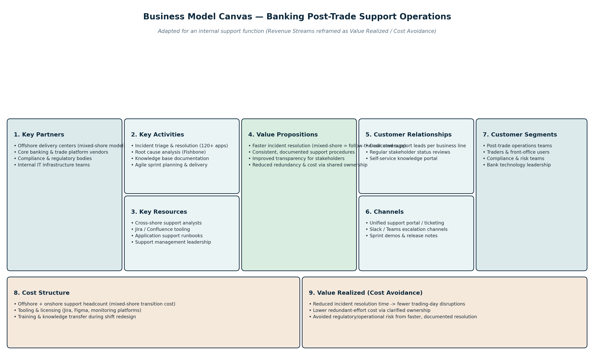
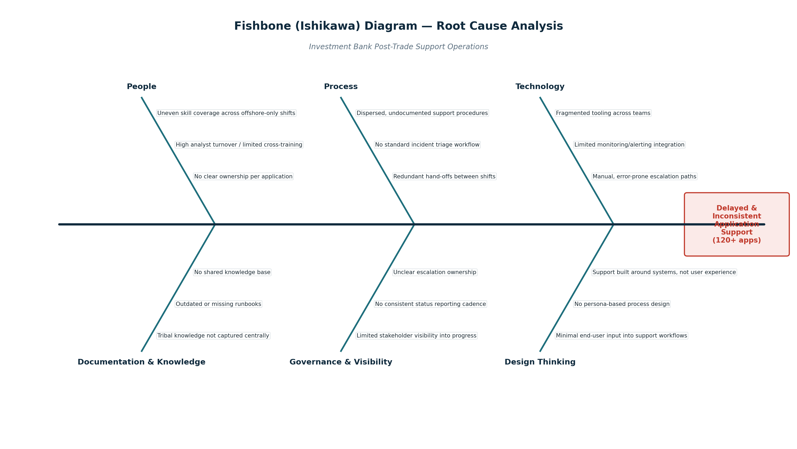
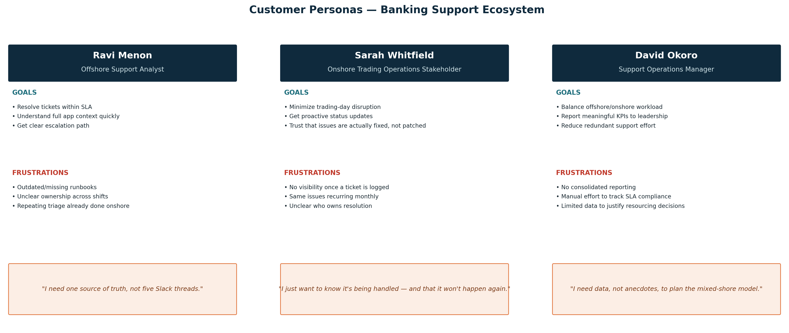
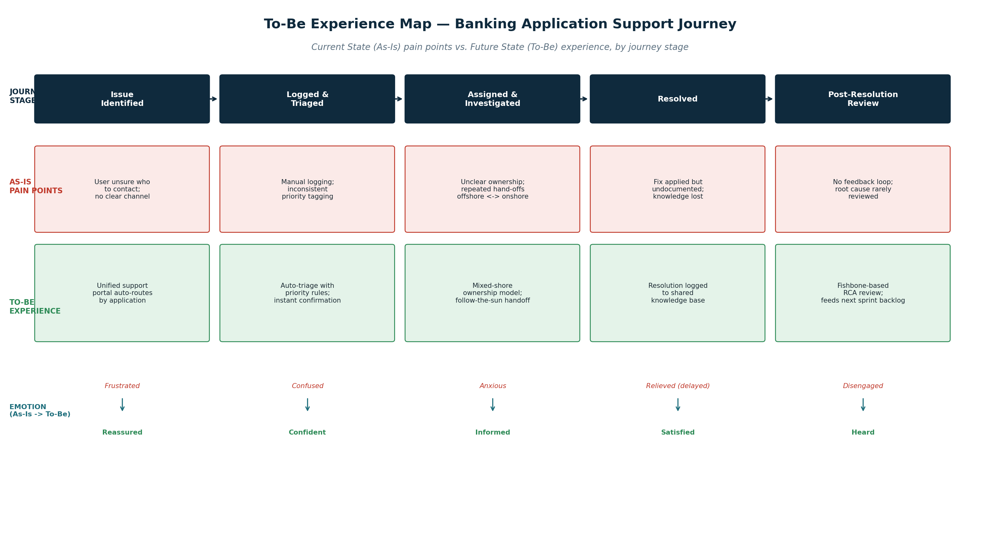
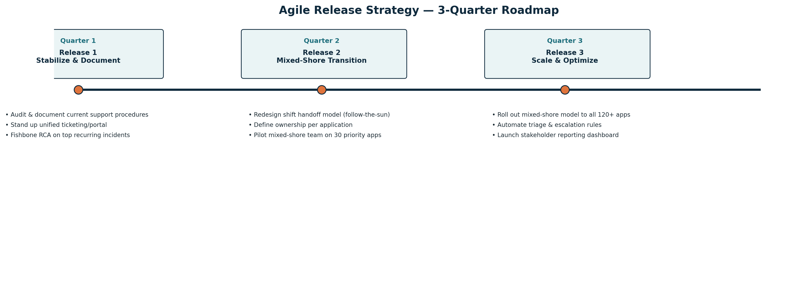

# Streamlining Banking Support Operations through Agile & Business Model Canvas

> **Business Analysis Case Study** demonstrating Agile planning, Business Model Canvas, Root Cause Analysis, Customer Personas, Journey Mapping, and Release Roadmap for improving post-trade banking application support operations.

---

# Project Overview

This project presents a Business Analysis case study focused on improving post-trade banking application support operations supporting over **120 business-critical applications**.

The objective was to analyze the current support model, identify operational bottlenecks, understand stakeholder pain points, and propose an Agile transformation roadmap to improve service quality, reduce incident resolution time, and enhance collaboration between offshore and onshore support teams.

---

# Business Problem

The organization was facing several operational challenges:

- Delayed incident resolution
- Multiple application ownership gaps
- Repeated ticket escalations
- Lack of standardized support processes
- Limited stakeholder visibility
- Knowledge scattered across multiple teams
- Inconsistent shift handoffs between offshore and onshore teams

These issues resulted in slower resolution times, increased operational risk, and poor stakeholder experience.

---

# Business Objectives

The proposed solution aimed to:

- Standardize application support processes
- Improve collaboration across global support teams
- Reduce recurring incidents through Root Cause Analysis
- Increase stakeholder transparency
- Improve knowledge management
- Enable Agile delivery and continuous improvement

---

# Business Analysis Techniques Used

- Business Model Canvas
- Root Cause Analysis (Fishbone Diagram)
- Customer Persona Analysis
- Customer Journey Mapping
- Agile Product Backlog
- Release Planning
- Stakeholder Analysis
- Process Improvement

---

# Deliverables

| Deliverable | Purpose |
|-------------|----------|
| Business Model Canvas | Understand the business ecosystem and value proposition |
| Fishbone Diagram | Identify root causes behind recurring incidents |
| Customer Personas | Capture stakeholder goals and frustrations |
| To-Be Journey Map | Design an improved support experience |
| Agile Backlog | Prioritize Epics, Features, and User Stories |
| Agile Release Roadmap | Plan phased implementation strategy |

---

# Tools Used

- Microsoft Excel
- Microsoft PowerPoint
- Jira (Agile planning approach)
- Business Model Canvas
- Agile Framework
- Process Mapping

---

# Project Artifacts

## Business Model Canvas



---

## Fishbone Root Cause Analysis



---

## Customer Personas



---

## To-Be Customer Journey



---

## Agile Release Roadmap



---

# Agile Delivery Approach

The implementation was planned across three releases:

### Release 1
- Audit existing support processes
- Standardize documentation
- Establish centralized ticketing

### Release 2
- Introduce mixed-shore operating model
- Define application ownership
- Pilot support transformation

### Release 3
- Scale operating model
- Automate triage and escalation
- Launch stakeholder dashboards

---

# Business Value Delivered

The proposed solution would help:

- Improve incident resolution time
- Reduce operational risk
- Improve SLA compliance
- Increase stakeholder satisfaction
- Reduce duplicated effort
- Improve knowledge sharing
- Enable continuous improvement through Agile delivery

---

# Repository Contents

```
README.md
Streamlining_Banking_Support_Ops.docx
Support_Ops_Agile_Backlog.xlsx
business_model_canvas.png
fishbone_diagram.png
personas.png
to_be_experience_map.png
agile_release_timeline.png
```

---

# Key Skills Demonstrated

- Business Analysis
- Agile Methodology
- Jira Backlog Planning
- User Story Writing
- Root Cause Analysis
- Business Process Improvement
- Stakeholder Analysis
- Customer Journey Mapping
- Business Model Canvas
- Release Planning

---

# Disclaimer

This project is a portfolio case study created to demonstrate Business Analysis methodologies and deliverables. It is intended for educational and professional portfolio purposes only.
